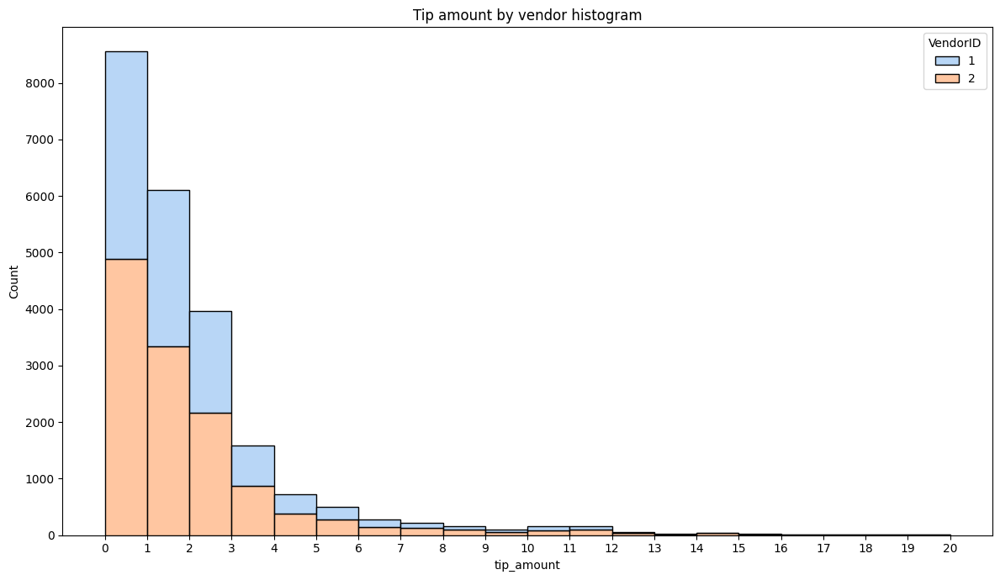

# New York Taxi Rides

## Tables of Contents
- [Project Overview](https://github.com/Phatolic/EDA-and-A-B-Testing-with-Python#project-overview)
- [EDA](https://github.com/Phatolic/EDA-and-A-B-Testing-with-Python#cleaning-and-eda)
- [A/B Testing](https://github.com/Phatolic/EDA-and-A-B-Testing-with-Python#)


### Project Overview
Automatidata is consulting for the New York City Taxi and Limousine Commission (TLC). New York City TLC is an agency responsible for licensing and regulating New York City's taxi cabs and for-hire vehicles. Automatidata then first perform some EDA and analysis beforehand. Then conduct a hypothesis testing to determine whether there is a statistically significant difference between customers who use credit card and customer who use cash in average taxi fare. 

```python
#Import libraries
import pandas as pd
import numpy as np

#Read file
df = pd.read_csv('2017_Yellow_Taxi_Trip_Data.csv')
```

## Cleaning and EDA


```python
df.head(10)
```


<table border="1" class="dataframe">
  <thead>
    <tr style="text-align: right;">
      <th></th>
      <th>Unnamed: 0</th>
      <th>VendorID</th>
      <th>tpep_pickup_datetime</th>
      <th>tpep_dropoff_datetime</th>
      <th>passenger_count</th>
      <th>trip_distance</th>
      <th>RatecodeID</th>
      <th>store_and_fwd_flag</th>
      <th>PULocationID</th>
      <th>DOLocationID</th>
      <th>payment_type</th>
      <th>fare_amount</th>
      <th>extra</th>
      <th>mta_tax</th>
      <th>tip_amount</th>
      <th>tolls_amount</th>
      <th>improvement_surcharge</th>
      <th>total_amount</th>
    </tr>
  </thead>
  <tbody>
    <tr>
      <th>0</th>
      <td>24870114</td>
      <td>2</td>
      <td>03/25/2017 8:55:43 AM</td>
      <td>03/25/2017 9:09:47 AM</td>
      <td>6</td>
      <td>3.34</td>
      <td>1</td>
      <td>N</td>
      <td>100</td>
      <td>231</td>
      <td>1</td>
      <td>13.0</td>
      <td>0.0</td>
      <td>0.5</td>
      <td>2.76</td>
      <td>0.0</td>
      <td>0.3</td>
      <td>16.56</td>
    </tr>
    <tr>
      <th>1</th>
      <td>35634249</td>
      <td>1</td>
      <td>04/11/2017 2:53:28 PM</td>
      <td>04/11/2017 3:19:58 PM</td>
      <td>1</td>
      <td>1.80</td>
      <td>1</td>
      <td>N</td>
      <td>186</td>
      <td>43</td>
      <td>1</td>
      <td>16.0</td>
      <td>0.0</td>
      <td>0.5</td>
      <td>4.00</td>
      <td>0.0</td>
      <td>0.3</td>
      <td>20.80</td>
    </tr>
    <tr>
      <th>2</th>
      <td>106203690</td>
      <td>1</td>
      <td>12/15/2017 7:26:56 AM</td>
      <td>12/15/2017 7:34:08 AM</td>
      <td>1</td>
      <td>1.00</td>
      <td>1</td>
      <td>N</td>
      <td>262</td>
      <td>236</td>
      <td>1</td>
      <td>6.5</td>
      <td>0.0</td>
      <td>0.5</td>
      <td>1.45</td>
      <td>0.0</td>
      <td>0.3</td>
      <td>8.75</td>
    </tr>
    <tr>
      <th>3</th>
      <td>38942136</td>
      <td>2</td>
      <td>05/07/2017 1:17:59 PM</td>
      <td>05/07/2017 1:48:14 PM</td>
      <td>1</td>
      <td>3.70</td>
      <td>1</td>
      <td>N</td>
      <td>188</td>
      <td>97</td>
      <td>1</td>
      <td>20.5</td>
      <td>0.0</td>
      <td>0.5</td>
      <td>6.39</td>
      <td>0.0</td>
      <td>0.3</td>
      <td>27.69</td>
    </tr>
    <tr>
      <th>4</th>
      <td>30841670</td>
      <td>2</td>
      <td>04/15/2017 11:32:20 PM</td>
      <td>04/15/2017 11:49:03 PM</td>
      <td>1</td>
      <td>4.37</td>
      <td>1</td>
      <td>N</td>
      <td>4</td>
      <td>112</td>
      <td>2</td>
      <td>16.5</td>
      <td>0.5</td>
      <td>0.5</td>
      <td>0.00</td>
      <td>0.0</td>
      <td>0.3</td>
      <td>17.80</td>
    </tr>
    <tr>
      <th>5</th>
      <td>23345809</td>
      <td>2</td>
      <td>03/25/2017 8:34:11 PM</td>
      <td>03/25/2017 8:42:11 PM</td>
      <td>6</td>
      <td>2.30</td>
      <td>1</td>
      <td>N</td>
      <td>161</td>
      <td>236</td>
      <td>1</td>
      <td>9.0</td>
      <td>0.5</td>
      <td>0.5</td>
      <td>2.06</td>
      <td>0.0</td>
      <td>0.3</td>
      <td>12.36</td>
    </tr>
    <tr>
      <th>6</th>
      <td>37660487</td>
      <td>2</td>
      <td>05/03/2017 7:04:09 PM</td>
      <td>05/03/2017 8:03:47 PM</td>
      <td>1</td>
      <td>12.83</td>
      <td>1</td>
      <td>N</td>
      <td>79</td>
      <td>241</td>
      <td>1</td>
      <td>47.5</td>
      <td>1.0</td>
      <td>0.5</td>
      <td>9.86</td>
      <td>0.0</td>
      <td>0.3</td>
      <td>59.16</td>
    </tr>
    <tr>
      <th>7</th>
      <td>69059411</td>
      <td>2</td>
      <td>08/15/2017 5:41:06 PM</td>
      <td>08/15/2017 6:03:05 PM</td>
      <td>1</td>
      <td>2.98</td>
      <td>1</td>
      <td>N</td>
      <td>237</td>
      <td>114</td>
      <td>1</td>
      <td>16.0</td>
      <td>1.0</td>
      <td>0.5</td>
      <td>1.78</td>
      <td>0.0</td>
      <td>0.3</td>
      <td>19.58</td>
    </tr>
    <tr>
      <th>8</th>
      <td>8433159</td>
      <td>2</td>
      <td>02/04/2017 4:17:07 PM</td>
      <td>02/04/2017 4:29:14 PM</td>
      <td>1</td>
      <td>1.20</td>
      <td>1</td>
      <td>N</td>
      <td>234</td>
      <td>249</td>
      <td>2</td>
      <td>9.0</td>
      <td>0.0</td>
      <td>0.5</td>
      <td>0.00</td>
      <td>0.0</td>
      <td>0.3</td>
      <td>9.80</td>
    </tr>
    <tr>
      <th>9</th>
      <td>95294817</td>
      <td>1</td>
      <td>11/10/2017 3:20:29 PM</td>
      <td>11/10/2017 3:40:55 PM</td>
      <td>1</td>
      <td>1.60</td>
      <td>1</td>
      <td>N</td>
      <td>239</td>
      <td>237</td>
      <td>1</td>
      <td>13.0</td>
      <td>0.0</td>
      <td>0.5</td>
      <td>2.75</td>
      <td>0.0</td>
      <td>0.3</td>
      <td>16.55</td>
    </tr>
  </tbody>
</table>
</div>


```python
df.info()
```

    <class 'pandas.core.frame.DataFrame'>
    RangeIndex: 22699 entries, 0 to 22698
    Data columns (total 18 columns):
     #   Column                 Non-Null Count  Dtype  
    ---  ------                 --------------  -----  
     0   Unnamed: 0             22699 non-null  int64  
     1   VendorID               22699 non-null  int64  
     2   tpep_pickup_datetime   22699 non-null  object 
     3   tpep_dropoff_datetime  22699 non-null  object 
     4   passenger_count        22699 non-null  int64  
     5   trip_distance          22699 non-null  float64
     6   RatecodeID             22699 non-null  int64  
     7   store_and_fwd_flag     22699 non-null  object 
     8   PULocationID           22699 non-null  int64  
     9   DOLocationID           22699 non-null  int64  
     10  payment_type           22699 non-null  int64  
     11  fare_amount            22699 non-null  float64
     12  extra                  22699 non-null  float64
     13  mta_tax                22699 non-null  float64
     14  tip_amount             22699 non-null  float64
     15  tolls_amount           22699 non-null  float64
     16  improvement_surcharge  22699 non-null  float64
     17  total_amount           22699 non-null  float64
    dtypes: float64(8), int64(7), object(3)
    memory usage: 3.1+ MB
    


```python
df.describe()
```


<table border="1" class="dataframe">
  <thead>
    <tr style="text-align: right;">
      <th></th>
      <th>Unnamed: 0</th>
      <th>VendorID</th>
      <th>passenger_count</th>
      <th>trip_distance</th>
      <th>RatecodeID</th>
      <th>PULocationID</th>
      <th>DOLocationID</th>
      <th>payment_type</th>
      <th>fare_amount</th>
      <th>extra</th>
      <th>mta_tax</th>
      <th>tip_amount</th>
      <th>tolls_amount</th>
      <th>improvement_surcharge</th>
      <th>total_amount</th>
    </tr>
  </thead>
  <tbody>
    <tr>
      <th>count</th>
      <td>2.269900e+04</td>
      <td>22699.000000</td>
      <td>22699.000000</td>
      <td>22699.000000</td>
      <td>22699.000000</td>
      <td>22699.000000</td>
      <td>22699.000000</td>
      <td>22699.000000</td>
      <td>22699.000000</td>
      <td>22699.000000</td>
      <td>22699.000000</td>
      <td>22699.000000</td>
      <td>22699.000000</td>
      <td>22699.000000</td>
      <td>22699.000000</td>
    </tr>
    <tr>
      <th>mean</th>
      <td>5.675849e+07</td>
      <td>1.556236</td>
      <td>1.642319</td>
      <td>2.913313</td>
      <td>1.043394</td>
      <td>162.412353</td>
      <td>161.527997</td>
      <td>1.336887</td>
      <td>13.026629</td>
      <td>0.333275</td>
      <td>0.497445</td>
      <td>1.835781</td>
      <td>0.312542</td>
      <td>0.299551</td>
      <td>16.310502</td>
    </tr>
    <tr>
      <th>std</th>
      <td>3.274493e+07</td>
      <td>0.496838</td>
      <td>1.285231</td>
      <td>3.653171</td>
      <td>0.708391</td>
      <td>66.633373</td>
      <td>70.139691</td>
      <td>0.496211</td>
      <td>13.243791</td>
      <td>0.463097</td>
      <td>0.039465</td>
      <td>2.800626</td>
      <td>1.399212</td>
      <td>0.015673</td>
      <td>16.097295</td>
    </tr>
    <tr>
      <th>min</th>
      <td>1.212700e+04</td>
      <td>1.000000</td>
      <td>0.000000</td>
      <td>0.000000</td>
      <td>1.000000</td>
      <td>1.000000</td>
      <td>1.000000</td>
      <td>1.000000</td>
      <td>-120.000000</td>
      <td>-1.000000</td>
      <td>-0.500000</td>
      <td>0.000000</td>
      <td>0.000000</td>
      <td>-0.300000</td>
      <td>-120.300000</td>
    </tr>
    <tr>
      <th>25%</th>
      <td>2.852056e+07</td>
      <td>1.000000</td>
      <td>1.000000</td>
      <td>0.990000</td>
      <td>1.000000</td>
      <td>114.000000</td>
      <td>112.000000</td>
      <td>1.000000</td>
      <td>6.500000</td>
      <td>0.000000</td>
      <td>0.500000</td>
      <td>0.000000</td>
      <td>0.000000</td>
      <td>0.300000</td>
      <td>8.750000</td>
    </tr>
    <tr>
      <th>50%</th>
      <td>5.673150e+07</td>
      <td>2.000000</td>
      <td>1.000000</td>
      <td>1.610000</td>
      <td>1.000000</td>
      <td>162.000000</td>
      <td>162.000000</td>
      <td>1.000000</td>
      <td>9.500000</td>
      <td>0.000000</td>
      <td>0.500000</td>
      <td>1.350000</td>
      <td>0.000000</td>
      <td>0.300000</td>
      <td>11.800000</td>
    </tr>
    <tr>
      <th>75%</th>
      <td>8.537452e+07</td>
      <td>2.000000</td>
      <td>2.000000</td>
      <td>3.060000</td>
      <td>1.000000</td>
      <td>233.000000</td>
      <td>233.000000</td>
      <td>2.000000</td>
      <td>14.500000</td>
      <td>0.500000</td>
      <td>0.500000</td>
      <td>2.450000</td>
      <td>0.000000</td>
      <td>0.300000</td>
      <td>17.800000</td>
    </tr>
    <tr>
      <th>max</th>
      <td>1.134863e+08</td>
      <td>2.000000</td>
      <td>6.000000</td>
      <td>33.960000</td>
      <td>99.000000</td>
      <td>265.000000</td>
      <td>265.000000</td>
      <td>4.000000</td>
      <td>999.990000</td>
      <td>4.500000</td>
      <td>0.500000</td>
      <td>200.000000</td>
      <td>19.100000</td>
      <td>0.300000</td>
      <td>1200.290000</td>
    </tr>
  </tbody>
</table>
</div>


```python
# Sort the data by trip distance from maximum to minimum value
df_sort_distance = df.sort_values('trip_distance', ascending = False)['trip_distance']
df_sort_distance.head()
```


    9280     33.96
    13861    33.92
    6064     32.72
    10291    31.95
    29       30.83
    Name: trip_distance, dtype: float64


```python
# Sort the data by total amount and print the top 20 values
df_sort_amount = df.sort_values('total_amount', ascending = False).nlargest(20,'total_amount')['total_amount']
df_sort_amount
```


    8476     1200.29
    20312     450.30
    13861     258.21
    12511     233.74
    15474     211.80
    6064      179.06
    16379     157.06
    3582      152.30
    11269     151.82
    9280      150.30
    1928      137.80
    10291     131.80
    6708      126.00
    11608     123.30
    908       121.56
    7281      120.96
    18130     119.31
    13621     115.94
    13359     111.95
    29        111.38
    Name: total_amount, dtype: float64


```python
# Sort the data by total amount and print the bottom 20 values
df.sort_values('total_amount')['total_amount'][:20]
```


    12944   -120.30
    20698     -5.80
    17602     -5.80
    11204     -5.30
    14714     -5.30
    8204      -4.80
    20317     -4.80
    10281     -4.30
    5448      -4.30
    4423      -4.30
    18565     -3.80
    314       -3.80
    5758      -3.80
    1646      -3.30
    10506      0.00
    4402       0.00
    5722       0.00
    22566      0.00
    19067      0.30
    14283      0.31
    Name: total_amount, dtype: float64


1. The longest rides are approximately 33 miles.
2. The top 2 total amount are significantly higher than the others.
3. The most expensive rides are not the longest ones.


```python
# How many of each payment type are represented in the data?
df['payment_type'].value_counts()
```


    payment_type
    1    15265
    2     7267
    3      121
    4       46
    Name: count, dtype: int64


```python
df.head()
```


<table border="1" class="dataframe">
  <thead>
    <tr style="text-align: right;">
      <th></th>
      <th>Unnamed: 0</th>
      <th>VendorID</th>
      <th>tpep_pickup_datetime</th>
      <th>tpep_dropoff_datetime</th>
      <th>passenger_count</th>
      <th>trip_distance</th>
      <th>RatecodeID</th>
      <th>store_and_fwd_flag</th>
      <th>PULocationID</th>
      <th>DOLocationID</th>
      <th>payment_type</th>
      <th>fare_amount</th>
      <th>extra</th>
      <th>mta_tax</th>
      <th>tip_amount</th>
      <th>tolls_amount</th>
      <th>improvement_surcharge</th>
      <th>total_amount</th>
    </tr>
  </thead>
  <tbody>
    <tr>
      <th>0</th>
      <td>24870114</td>
      <td>2</td>
      <td>03/25/2017 8:55:43 AM</td>
      <td>03/25/2017 9:09:47 AM</td>
      <td>6</td>
      <td>3.34</td>
      <td>1</td>
      <td>N</td>
      <td>100</td>
      <td>231</td>
      <td>1</td>
      <td>13.0</td>
      <td>0.0</td>
      <td>0.5</td>
      <td>2.76</td>
      <td>0.0</td>
      <td>0.3</td>
      <td>16.56</td>
    </tr>
    <tr>
      <th>1</th>
      <td>35634249</td>
      <td>1</td>
      <td>04/11/2017 2:53:28 PM</td>
      <td>04/11/2017 3:19:58 PM</td>
      <td>1</td>
      <td>1.80</td>
      <td>1</td>
      <td>N</td>
      <td>186</td>
      <td>43</td>
      <td>1</td>
      <td>16.0</td>
      <td>0.0</td>
      <td>0.5</td>
      <td>4.00</td>
      <td>0.0</td>
      <td>0.3</td>
      <td>20.80</td>
    </tr>
    <tr>
      <th>2</th>
      <td>106203690</td>
      <td>1</td>
      <td>12/15/2017 7:26:56 AM</td>
      <td>12/15/2017 7:34:08 AM</td>
      <td>1</td>
      <td>1.00</td>
      <td>1</td>
      <td>N</td>
      <td>262</td>
      <td>236</td>
      <td>1</td>
      <td>6.5</td>
      <td>0.0</td>
      <td>0.5</td>
      <td>1.45</td>
      <td>0.0</td>
      <td>0.3</td>
      <td>8.75</td>
    </tr>
    <tr>
      <th>3</th>
      <td>38942136</td>
      <td>2</td>
      <td>05/07/2017 1:17:59 PM</td>
      <td>05/07/2017 1:48:14 PM</td>
      <td>1</td>
      <td>3.70</td>
      <td>1</td>
      <td>N</td>
      <td>188</td>
      <td>97</td>
      <td>1</td>
      <td>20.5</td>
      <td>0.0</td>
      <td>0.5</td>
      <td>6.39</td>
      <td>0.0</td>
      <td>0.3</td>
      <td>27.69</td>
    </tr>
    <tr>
      <th>4</th>
      <td>30841670</td>
      <td>2</td>
      <td>04/15/2017 11:32:20 PM</td>
      <td>04/15/2017 11:49:03 PM</td>
      <td>1</td>
      <td>4.37</td>
      <td>1</td>
      <td>N</td>
      <td>4</td>
      <td>112</td>
      <td>2</td>
      <td>16.5</td>
      <td>0.5</td>
      <td>0.5</td>
      <td>0.00</td>
      <td>0.0</td>
      <td>0.3</td>
      <td>17.80</td>
    </tr>
  </tbody>
</table>
</div>


```python
# What is the average tip for trips paid for with credit card?
avg_cc_tip = df[df['payment_type'] == 1]['tip_amount'].mean()
print('Avg. cc tip:', avg_cc_tip)
# What is the average tip for trips paid for with cash?
avg_cash_tip = df[df['payment_type'] == 2]['tip_amount'].mean()
print('Avg. cash tip:', avg_cash_tip)
```

Avg. cc tip: 2.7298001965280054  
Avg. cash tip: 0.0
    


```python
# How many times is each vendor ID represented in the data?
df['VendorID'].value_counts()
```


    VendorID
    2    12626
    1    10073
    Name: count, dtype: int64


```python
# What is the mean total amount for each vendor?
df.groupby(['VendorID'])[['total_amount']].mean()
```


<div>
<table border="1" class="dataframe">
  <thead>
    <tr style="text-align: right;">
      <th></th>
      <th>total_amount</th>
    </tr>
    <tr>
      <th>VendorID</th>
      <th></th>
    </tr>
  </thead>
  <tbody>
    <tr>
      <th>1</th>
      <td>16.298119</td>
    </tr>
    <tr>
      <th>2</th>
      <td>16.320382</td>
    </tr>
  </tbody>
</table>
</div>


```python
# Filter the data for credit card payments only
credit_card = df[df['payment_type'] == 1]

# Filter the credit-card-only data for passenger count only
credit_card['passenger_count'].value_counts()
```


    passenger_count
    1    10977
    2     2168
    5      775
    3      600
    6      451
    4      267
    0       27
    Name: count, dtype: int64


```python
# Calculate the average tip amount for each passenger count (credit card payments only)
credit_card.groupby(['passenger_count'])[['tip_amount']].mean()
```


<div>
<table border="1" class="dataframe">
  <thead>
    <tr style="text-align: right;">
      <th></th>
      <th>tip_amount</th>
    </tr>
    <tr>
      <th>passenger_count</th>
      <th></th>
    </tr>
  </thead>
  <tbody>
    <tr>
      <th>0</th>
      <td>2.610370</td>
    </tr>
    <tr>
      <th>1</th>
      <td>2.714681</td>
    </tr>
    <tr>
      <th>2</th>
      <td>2.829949</td>
    </tr>
    <tr>
      <th>3</th>
      <td>2.726800</td>
    </tr>
    <tr>
      <th>4</th>
      <td>2.607753</td>
    </tr>
    <tr>
      <th>5</th>
      <td>2.762645</td>
    </tr>
    <tr>
      <th>6</th>
      <td>2.643326</td>
    </tr>
  </tbody>
</table>
</div>


#### The two variables that are most likely to help build a predictive model for taxi ride fares are total_amount and trip_distance because they show a picture of a taxi cab ride.


```python
import datetime as dt
```


```python
df.head()
```


<div>
<table border="1" class="dataframe">
  <thead>
    <tr style="text-align: right;">
      <th></th>
      <th>Unnamed: 0</th>
      <th>VendorID</th>
      <th>tpep_pickup_datetime</th>
      <th>tpep_dropoff_datetime</th>
      <th>passenger_count</th>
      <th>trip_distance</th>
      <th>RatecodeID</th>
      <th>store_and_fwd_flag</th>
      <th>PULocationID</th>
      <th>DOLocationID</th>
      <th>payment_type</th>
      <th>fare_amount</th>
      <th>extra</th>
      <th>mta_tax</th>
      <th>tip_amount</th>
      <th>tolls_amount</th>
      <th>improvement_surcharge</th>
      <th>total_amount</th>
    </tr>
  </thead>
  <tbody>
    <tr>
      <th>0</th>
      <td>24870114</td>
      <td>2</td>
      <td>03/25/2017 8:55:43 AM</td>
      <td>03/25/2017 9:09:47 AM</td>
      <td>6</td>
      <td>3.34</td>
      <td>1</td>
      <td>N</td>
      <td>100</td>
      <td>231</td>
      <td>1</td>
      <td>13.0</td>
      <td>0.0</td>
      <td>0.5</td>
      <td>2.76</td>
      <td>0.0</td>
      <td>0.3</td>
      <td>16.56</td>
    </tr>
    <tr>
      <th>1</th>
      <td>35634249</td>
      <td>1</td>
      <td>04/11/2017 2:53:28 PM</td>
      <td>04/11/2017 3:19:58 PM</td>
      <td>1</td>
      <td>1.80</td>
      <td>1</td>
      <td>N</td>
      <td>186</td>
      <td>43</td>
      <td>1</td>
      <td>16.0</td>
      <td>0.0</td>
      <td>0.5</td>
      <td>4.00</td>
      <td>0.0</td>
      <td>0.3</td>
      <td>20.80</td>
    </tr>
    <tr>
      <th>2</th>
      <td>106203690</td>
      <td>1</td>
      <td>12/15/2017 7:26:56 AM</td>
      <td>12/15/2017 7:34:08 AM</td>
      <td>1</td>
      <td>1.00</td>
      <td>1</td>
      <td>N</td>
      <td>262</td>
      <td>236</td>
      <td>1</td>
      <td>6.5</td>
      <td>0.0</td>
      <td>0.5</td>
      <td>1.45</td>
      <td>0.0</td>
      <td>0.3</td>
      <td>8.75</td>
    </tr>
    <tr>
      <th>3</th>
      <td>38942136</td>
      <td>2</td>
      <td>05/07/2017 1:17:59 PM</td>
      <td>05/07/2017 1:48:14 PM</td>
      <td>1</td>
      <td>3.70</td>
      <td>1</td>
      <td>N</td>
      <td>188</td>
      <td>97</td>
      <td>1</td>
      <td>20.5</td>
      <td>0.0</td>
      <td>0.5</td>
      <td>6.39</td>
      <td>0.0</td>
      <td>0.3</td>
      <td>27.69</td>
    </tr>
    <tr>
      <th>4</th>
      <td>30841670</td>
      <td>2</td>
      <td>04/15/2017 11:32:20 PM</td>
      <td>04/15/2017 11:49:03 PM</td>
      <td>1</td>
      <td>4.37</td>
      <td>1</td>
      <td>N</td>
      <td>4</td>
      <td>112</td>
      <td>2</td>
      <td>16.5</td>
      <td>0.5</td>
      <td>0.5</td>
      <td>0.00</td>
      <td>0.0</td>
      <td>0.3</td>
      <td>17.80</td>
    </tr>
  </tbody>
</table>
</div>


```python
# Import libraries 
import matplotlib.pyplot as plt
import seaborn as sns
# Convert data columns to datetime
df['tpep_pickup_datetime']=pd.to_datetime(df['tpep_pickup_datetime'])
df['tpep_dropoff_datetime']=pd.to_datetime(df['tpep_dropoff_datetime'])
```

**Trip Distance**


```python
fig, ax = plt.subplots(1,2, figsize = (12,5))
# Create box plot of trip_distance
sns.boxplot(x = df['trip_distance'], ax = ax[0])
ax[0].set_title('trip_distance')
# Create histogram of trip_distance
sns.histplot(df['trip_distance'], bins = range(0,26,1),ax = ax[1])
ax[1].set_title('Trip distace histogram')

plt.tight_layout()
```


    

    


##### *The majority of trips were journey of less than 2 miles.*

**Total Amount**


```python
fig, ax = plt.subplots(1,2, figsize = (12,5))
# Create box plot of trip_distance
sns.boxplot(x = df['total_amount'], ax = ax[0], fliersize = 1)
ax[0].set_title('total_amount')
# Create histogram of trip_distance
sns.histplot(df['total_amount'], bins=range(-10,101,5),ax = ax[1])
ax[1].set_title('Total amount histogram')
ax[1].set_xticks(range(-10,101,5))
ax[1].set_xticklabels(range(-10,101,5))

plt.tight_layout()
```


    

    


##### *The total cost of each trip also has a distribution that skews right, with most cost betwenn 5 to 15 dollars*

**Tip Amount**


```python
fig, ax = plt.subplots(1,2, figsize = (12,5))
# Create box plot of trip_distance
sns.boxplot(x = df['tip_amount'], ax = ax[0], fliersize = 1)
ax[0].set_title('tip_amount')
# Create histogram of trip_distance
sns.histplot(df['tip_amount'], bins=range(0,21,1),ax = ax[1])
ax[1].set_title('Tip amount histogram')
ax[1].set_xticks(range(0,21,1))
ax[1].set_xticklabels(range(0,21,1))

plt.tight_layout()
```


    

    


##### *The distribution is right-skewed, with most tips fall in between 1 and 3 dollars*

**Tip Amount by Vendor**


```python
fig, ax = plt.subplots(figsize = (12,7))
# A histogram of tip amount by vendor
sns.histplot(x = df['tip_amount'],hue = df['VendorID'] , multiple = 'stack',palette = 'pastel',bins = range(0,21,1))
ax.set_xticks(range(0,21,1))
ax.set_title('Tip amount by vendor histogram')
plt.tight_layout()
```


    

    


##### *Vendor 2 has slightly higher share of the rides, this proportion is maintained for all tips amount*


```python
# Create histogram of tip_amount by vendor for tips > $10 
df_tips = df[df['tip_amount'] > 10]

fig, ax = plt.subplots(figsize = (8))
# A histogram of tip amount by vendor
sns.histplot(x = df_tips['tip_amount'],hue = df_tips['VendorID'] , multiple = 'stack',palette = 'pastel',bins = range(10,21,1))
ax.set_xticks(range(10,21,1))
ax.set_title('Tip amount by vendor histogram')
plt.tight_layout()
```


    

    


##### *The proportions are maintained even at these higher tip amounts*

**Mean tips by passenger count**


```python
df.head()
```


<div>
<table border="1" class="dataframe">
  <thead>
    <tr style="text-align: right;">
      <th></th>
      <th>Unnamed: 0</th>
      <th>VendorID</th>
      <th>tpep_pickup_datetime</th>
      <th>tpep_dropoff_datetime</th>
      <th>passenger_count</th>
      <th>trip_distance</th>
      <th>RatecodeID</th>
      <th>store_and_fwd_flag</th>
      <th>PULocationID</th>
      <th>DOLocationID</th>
      <th>payment_type</th>
      <th>fare_amount</th>
      <th>extra</th>
      <th>mta_tax</th>
      <th>tip_amount</th>
      <th>tolls_amount</th>
      <th>improvement_surcharge</th>
      <th>total_amount</th>
    </tr>
  </thead>
  <tbody>
    <tr>
      <th>0</th>
      <td>24870114</td>
      <td>2</td>
      <td>2017-03-25 08:55:43</td>
      <td>2017-03-25 09:09:47</td>
      <td>6</td>
      <td>3.34</td>
      <td>1</td>
      <td>N</td>
      <td>100</td>
      <td>231</td>
      <td>1</td>
      <td>13.0</td>
      <td>0.0</td>
      <td>0.5</td>
      <td>2.76</td>
      <td>0.0</td>
      <td>0.3</td>
      <td>16.56</td>
    </tr>
    <tr>
      <th>1</th>
      <td>35634249</td>
      <td>1</td>
      <td>2017-04-11 14:53:28</td>
      <td>2017-04-11 15:19:58</td>
      <td>1</td>
      <td>1.80</td>
      <td>1</td>
      <td>N</td>
      <td>186</td>
      <td>43</td>
      <td>1</td>
      <td>16.0</td>
      <td>0.0</td>
      <td>0.5</td>
      <td>4.00</td>
      <td>0.0</td>
      <td>0.3</td>
      <td>20.80</td>
    </tr>
    <tr>
      <th>2</th>
      <td>106203690</td>
      <td>1</td>
      <td>2017-12-15 07:26:56</td>
      <td>2017-12-15 07:34:08</td>
      <td>1</td>
      <td>1.00</td>
      <td>1</td>
      <td>N</td>
      <td>262</td>
      <td>236</td>
      <td>1</td>
      <td>6.5</td>
      <td>0.0</td>
      <td>0.5</td>
      <td>1.45</td>
      <td>0.0</td>
      <td>0.3</td>
      <td>8.75</td>
    </tr>
    <tr>
      <th>3</th>
      <td>38942136</td>
      <td>2</td>
      <td>2017-05-07 13:17:59</td>
      <td>2017-05-07 13:48:14</td>
      <td>1</td>
      <td>3.70</td>
      <td>1</td>
      <td>N</td>
      <td>188</td>
      <td>97</td>
      <td>1</td>
      <td>20.5</td>
      <td>0.0</td>
      <td>0.5</td>
      <td>6.39</td>
      <td>0.0</td>
      <td>0.3</td>
      <td>27.69</td>
    </tr>
    <tr>
      <th>4</th>
      <td>30841670</td>
      <td>2</td>
      <td>2017-04-15 23:32:20</td>
      <td>2017-04-15 23:49:03</td>
      <td>1</td>
      <td>4.37</td>
      <td>1</td>
      <td>N</td>
      <td>4</td>
      <td>112</td>
      <td>2</td>
      <td>16.5</td>
      <td>0.5</td>
      <td>0.5</td>
      <td>0.00</td>
      <td>0.0</td>
      <td>0.3</td>
      <td>17.80</td>
    </tr>
  </tbody>
</table>
</div>


```python
# Calculate mean tips by passenger_count
mean_tips_by_passenger_count = df.groupby(['passenger_count'])[['tip_amount']].mean()
mean_tips_by_passenger_count
```


<div>
<table border="1" class="dataframe">
  <thead>
    <tr style="text-align: right;">
      <th></th>
      <th>tip_amount</th>
    </tr>
    <tr>
      <th>passenger_count</th>
      <th></th>
    </tr>
  </thead>
  <tbody>
    <tr>
      <th>0</th>
      <td>2.135758</td>
    </tr>
    <tr>
      <th>1</th>
      <td>1.848920</td>
    </tr>
    <tr>
      <th>2</th>
      <td>1.856378</td>
    </tr>
    <tr>
      <th>3</th>
      <td>1.716768</td>
    </tr>
    <tr>
      <th>4</th>
      <td>1.530264</td>
    </tr>
    <tr>
      <th>5</th>
      <td>1.873185</td>
    </tr>
    <tr>
      <th>6</th>
      <td>1.720260</td>
    </tr>
  </tbody>
</table>
</div>


```python
# Create a month column
df['month'] = df['tpep_pickup_datetime'].dt.month_name()
# Create a day columm
df['day'] = df['tpep_pickup_datetime'].dt.day_name()
```

**Total ride count by month**


```python
# Get total number of rides for each month
monthly_rides = df['month'].value_counts()
month_order = ['January', 'February', 'March', 'April', 'May', 'June', 'July',
         'August', 'September', 'October', 'November', 'December']
monthly_rides = monthly_rides.reindex(index = month_order)
monthly_rides
```


    month
    January      1997
    February     1769
    March        2049
    April        2019
    May          2013
    June         1964
    July         1697
    August       1724
    September    1734
    October      2027
    November     1843
    December     1863
    Name: count, dtype: int64


```python
# Create a bar plot of total rides per month
plt.figure(figsize=(12,5))
sns.barplot(x = monthly_rides.index, y = monthly_rides)

plt.title('Ride count by month', fontsize=16)
plt.show()
```


    

    


##### *Monthly rides are consistent thoroughout the months*

**Total ride count by month**


```python
# Get total number of rides for each day
daily_rides = df['day'].value_counts()
day_order = ['Monday', 'Tuesday', 'Wednesday', 'Thursday', 'Friday', 'Saturday', 'Sunday']
daily_rides = daily_rides.reindex(index = day_order)
daily_rides
```


    day
    Monday       2931
    Tuesday      3198
    Wednesday    3390
    Thursday     3402
    Friday       3413
    Saturday     3367
    Sunday       2998
    Name: count, dtype: int64


```python
# Create bar plot for ride count by day
plt.figure(figsize = (8,4))
sns.barplot(x = daily_rides.index, y = daily_rides)
plt.title('Ride count by day', fontsize = 16)
plt.show()
```


    

    


##### *Wednesday to Saturday have higher number of rides than Monday and Sunday*

**Total revenue by day of week**


```python
# Revenue by day
day_order = ['Monday', 'Tuesday', 'Wednesday', 'Thursday', 'Friday', 'Saturday', 'Sunday']
total_amount_day = df.groupby('day')[['total_amount']].sum()
total_amount_day = total_amount_day.reindex(index = day_order)
total_amount_day
```


<div>
<table border="1" class="dataframe">
  <thead>
    <tr style="text-align: right;">
      <th></th>
      <th>total_amount</th>
    </tr>
    <tr>
      <th>day</th>
      <th></th>
    </tr>
  </thead>
  <tbody>
    <tr>
      <th>Monday</th>
      <td>49574.37</td>
    </tr>
    <tr>
      <th>Tuesday</th>
      <td>52527.14</td>
    </tr>
    <tr>
      <th>Wednesday</th>
      <td>55310.47</td>
    </tr>
    <tr>
      <th>Thursday</th>
      <td>57181.91</td>
    </tr>
    <tr>
      <th>Friday</th>
      <td>55818.74</td>
    </tr>
    <tr>
      <th>Saturday</th>
      <td>51195.40</td>
    </tr>
    <tr>
      <th>Sunday</th>
      <td>48624.06</td>
    </tr>
  </tbody>
</table>
</div>


```python
# Create bar plot of total revenue by day
fig, ax = plt.subplots(figsize=(10,7))
sns.barplot(x=total_amount_day.index, y=total_amount_day['total_amount'])
ax.set_xticks(day_order)
ax.set_xticklabels(day_order)
ax.set_ylabel('Revenue (USD)')
plt.title('Total revenue by day', fontsize=16)
plt.show()
```


    

    


##### *Thursday had the highest gross revenue across all days*

**Total revenue by month**


```python
# Total revenue by month
total_amount_month = df.groupby('month')[['total_amount']].sum()
month_order = ['January', 'February', 'March', 'April', 'May', 'June', 'July',
         'August', 'September', 'October', 'November', 'December']
total_amount_month = total_amount_month.reindex(index = month_order)
total_amount_month
```


<div>
<table border="1" class="dataframe">
  <thead>
    <tr style="text-align: right;">
      <th></th>
      <th>total_amount</th>
    </tr>
    <tr>
      <th>month</th>
      <th></th>
    </tr>
  </thead>
  <tbody>
    <tr>
      <th>January</th>
      <td>31735.25</td>
    </tr>
    <tr>
      <th>February</th>
      <td>28937.89</td>
    </tr>
    <tr>
      <th>March</th>
      <td>33085.89</td>
    </tr>
    <tr>
      <th>April</th>
      <td>32012.54</td>
    </tr>
    <tr>
      <th>May</th>
      <td>33828.58</td>
    </tr>
    <tr>
      <th>June</th>
      <td>32920.52</td>
    </tr>
    <tr>
      <th>July</th>
      <td>26617.64</td>
    </tr>
    <tr>
      <th>August</th>
      <td>27759.56</td>
    </tr>
    <tr>
      <th>September</th>
      <td>28206.38</td>
    </tr>
    <tr>
      <th>October</th>
      <td>33065.83</td>
    </tr>
    <tr>
      <th>November</th>
      <td>30800.44</td>
    </tr>
    <tr>
      <th>December</th>
      <td>31261.57</td>
    </tr>
  </tbody>
</table>
</div>


```python
# Create a bar plot of total revenue by month
plt.figure(figsize=(12,7))
ax = sns.barplot(x=total_amount_month.index, y=total_amount_month['total_amount'])
plt.title('Total revenue by month', fontsize=16);
```


    

    


##### *The revenue declined in summer months and in February*

**Mean trip distance by drop off locations**


```python
#  Get number of unique drop-off location IDs
df['DOLocationID'].nunique()
```


216


```python
# Calculate the mean trip distance for each drop-off location
distance_by_dropoff = df.groupby('DOLocationID')[['trip_distance']].mean()

# Sort the results in descending order by mean trip distance
distance_by_dropoff = distance_by_dropoff.sort_values('trip_distance', ascending = False)
distance_by_dropoff
```


<div>
<table border="1" class="dataframe">
  <thead>
    <tr style="text-align: right;">
      <th></th>
      <th>trip_distance</th>
    </tr>
    <tr>
      <th>DOLocationID</th>
      <th></th>
    </tr>
  </thead>
  <tbody>
    <tr>
      <th>23</th>
      <td>24.275000</td>
    </tr>
    <tr>
      <th>29</th>
      <td>21.650000</td>
    </tr>
    <tr>
      <th>210</th>
      <td>20.500000</td>
    </tr>
    <tr>
      <th>11</th>
      <td>17.945000</td>
    </tr>
    <tr>
      <th>51</th>
      <td>17.310000</td>
    </tr>
    <tr>
      <th>...</th>
      <td>...</td>
    </tr>
    <tr>
      <th>137</th>
      <td>1.818852</td>
    </tr>
    <tr>
      <th>234</th>
      <td>1.727806</td>
    </tr>
    <tr>
      <th>237</th>
      <td>1.555494</td>
    </tr>
    <tr>
      <th>193</th>
      <td>1.390556</td>
    </tr>
    <tr>
      <th>207</th>
      <td>1.200000</td>
    </tr>
  </tbody>
</table>
<p>216 rows × 1 columns</p>
</div>


```python
# Create a bar plot of mean trip distances by drop-off location in ascending order by distance
fig, ax = plt.subplots(figsize = (14,6))
sns.barplot(x = distance_by_dropoff.index, y = distance_by_dropoff['trip_distance'],order = distance_by_dropoff.index)
ax.set_xticklabels([])
ax.set_xticks([])
plt.title('Mean trip distance by drop-off location', fontsize=16);
```


    

    


**Histogram of rides by drop off locations**


```python
# Check if all drop-off locations are consecutively numbered
a = df['DOLocationID'].max()  - len(set(df['DOLocationID']))
print(f'There are {a} numbers not represent a location.')
```

There are 49 numbers not represent a location.
    


```python
fig, ax = plt.subplots(figsize=(16,4))
# DOLocationID column is numeric, so sort in ascending order
sorted_dropoffs = df['DOLocationID'].sort_values()
# Convert to string
sorted_dropoffs = sorted_dropoffs.astype('str')
# Plot
sns.histplot(sorted_dropoffs, bins = range(0, df['DOLocationID'].max() + 1, 1))
ax.set_xlabel('Drop-off locations')
ax.set_xticks([])
ax.set_xticklabels([])
plt.show()
```


    

    


##### **The high traffic locations might be train station, airport, Times Square, Empire State Bulding,...**

## A/B Testing

### Is there a relationship between total fare amount and payment type?


```python
df.head()
```


<div>
<table border="1" class="dataframe">
  <thead>
    <tr style="text-align: right;">
      <th></th>
      <th>Unnamed: 0</th>
      <th>VendorID</th>
      <th>tpep_pickup_datetime</th>
      <th>tpep_dropoff_datetime</th>
      <th>passenger_count</th>
      <th>trip_distance</th>
      <th>RatecodeID</th>
      <th>store_and_fwd_flag</th>
      <th>PULocationID</th>
      <th>DOLocationID</th>
      <th>payment_type</th>
      <th>fare_amount</th>
      <th>extra</th>
      <th>mta_tax</th>
      <th>tip_amount</th>
      <th>tolls_amount</th>
      <th>improvement_surcharge</th>
      <th>total_amount</th>
      <th>month</th>
      <th>day</th>
    </tr>
  </thead>
  <tbody>
    <tr>
      <th>0</th>
      <td>24870114</td>
      <td>2</td>
      <td>2017-03-25 08:55:43</td>
      <td>2017-03-25 09:09:47</td>
      <td>6</td>
      <td>3.34</td>
      <td>1</td>
      <td>N</td>
      <td>100</td>
      <td>231</td>
      <td>1</td>
      <td>13.0</td>
      <td>0.0</td>
      <td>0.5</td>
      <td>2.76</td>
      <td>0.0</td>
      <td>0.3</td>
      <td>16.56</td>
      <td>March</td>
      <td>Saturday</td>
    </tr>
    <tr>
      <th>1</th>
      <td>35634249</td>
      <td>1</td>
      <td>2017-04-11 14:53:28</td>
      <td>2017-04-11 15:19:58</td>
      <td>1</td>
      <td>1.80</td>
      <td>1</td>
      <td>N</td>
      <td>186</td>
      <td>43</td>
      <td>1</td>
      <td>16.0</td>
      <td>0.0</td>
      <td>0.5</td>
      <td>4.00</td>
      <td>0.0</td>
      <td>0.3</td>
      <td>20.80</td>
      <td>April</td>
      <td>Tuesday</td>
    </tr>
    <tr>
      <th>2</th>
      <td>106203690</td>
      <td>1</td>
      <td>2017-12-15 07:26:56</td>
      <td>2017-12-15 07:34:08</td>
      <td>1</td>
      <td>1.00</td>
      <td>1</td>
      <td>N</td>
      <td>262</td>
      <td>236</td>
      <td>1</td>
      <td>6.5</td>
      <td>0.0</td>
      <td>0.5</td>
      <td>1.45</td>
      <td>0.0</td>
      <td>0.3</td>
      <td>8.75</td>
      <td>December</td>
      <td>Friday</td>
    </tr>
    <tr>
      <th>3</th>
      <td>38942136</td>
      <td>2</td>
      <td>2017-05-07 13:17:59</td>
      <td>2017-05-07 13:48:14</td>
      <td>1</td>
      <td>3.70</td>
      <td>1</td>
      <td>N</td>
      <td>188</td>
      <td>97</td>
      <td>1</td>
      <td>20.5</td>
      <td>0.0</td>
      <td>0.5</td>
      <td>6.39</td>
      <td>0.0</td>
      <td>0.3</td>
      <td>27.69</td>
      <td>May</td>
      <td>Sunday</td>
    </tr>
    <tr>
      <th>4</th>
      <td>30841670</td>
      <td>2</td>
      <td>2017-04-15 23:32:20</td>
      <td>2017-04-15 23:49:03</td>
      <td>1</td>
      <td>4.37</td>
      <td>1</td>
      <td>N</td>
      <td>4</td>
      <td>112</td>
      <td>2</td>
      <td>16.5</td>
      <td>0.5</td>
      <td>0.5</td>
      <td>0.00</td>
      <td>0.0</td>
      <td>0.3</td>
      <td>17.80</td>
      <td>April</td>
      <td>Saturday</td>
    </tr>
  </tbody>
</table>
</div>


```python
df.groupby('payment_type')[['fare_amount']].mean()
```


<div>

<table border="1" class="dataframe">
  <thead>
    <tr style="text-align: right;">
      <th></th>
      <th>fare_amount</th>
    </tr>
    <tr>
      <th>payment_type</th>
      <th></th>
    </tr>
  </thead>
  <tbody>
    <tr>
      <th>1</th>
      <td>13.429748</td>
    </tr>
    <tr>
      <th>2</th>
      <td>12.213546</td>
    </tr>
    <tr>
      <th>3</th>
      <td>12.186116</td>
    </tr>
    <tr>
      <th>4</th>
      <td>9.913043</td>
    </tr>
  </tbody>
</table>
</div>


*1: Credit card*  
*2: Cash*

**The customers who pay in credit card tend to pay larger fare than the ones who pay in cash. But it might due to random chance , rather than the true difference in fare amount. To assess it is not due to chance, we conduct a hypothesis testing**

**Use two-sample test**
1. The null hypothesis and alternative hypothesis  
    Null hypothesis: There is no difference in average fare who use credit card and customer who use cash.  
    Alternaive hypothesis: There is difference in average fare who use credit card and customer who use cash.
2. Choose 5% significance level
3. Find the p-value
4. Conclusion


```python
credit_card = df[df['payment_type'] == 1]['fare_amount']
cash = df[df['payment_type'] == 2]['fare_amount']

credit_card_mean = credit_card.mean() 
cash_mean = cash.mean()

credit_card_std = credit_card.std()
cash_std = cash.std()

result = (credit_card_mean - cash_mean)/(np.sqrt(((credit_card_std) ** 2) / len(credit_card) + ((cash_std) ** 2 / len(cash))))
print('t-statistic:',result)
```

1. t-statistic: 6.866800855655372
    


```python
from scipy import stats
credit_card = df[df['payment_type'] == 1]['fare_amount']
cash = df[df['payment_type'] == 2]['fare_amount']
stats.ttest_ind(a = credit_card , b = cash, equal_var = False)
```


    TtestResult(statistic=6.866800855655372, pvalue=6.797387473030518e-12, df=16675.48547403633)


##### *The p-value is significantly smaller than the significance level of 5%, you reject the null hypothesis.*
##### So we could encourage customers to pay with credit card. But there are many factos like riders might not carry lots of cash, so they pay with credit card instead .


```python

```
